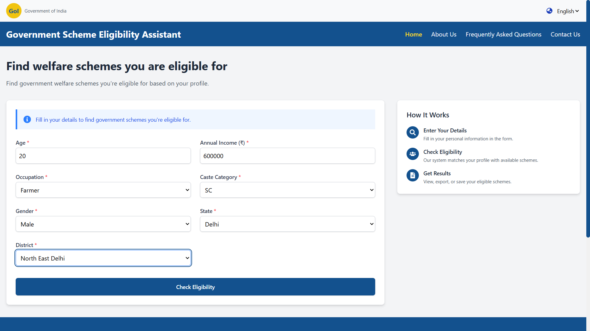
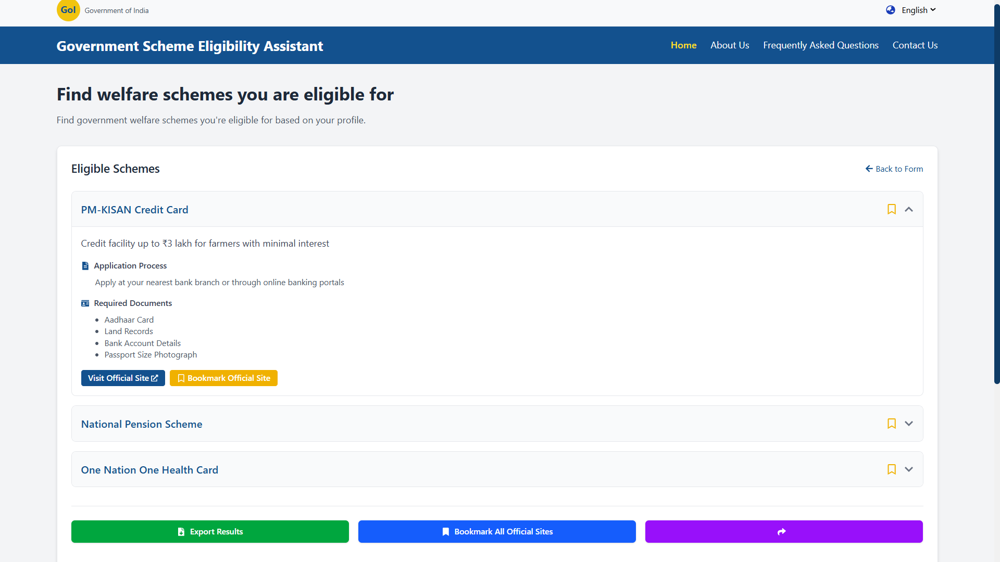
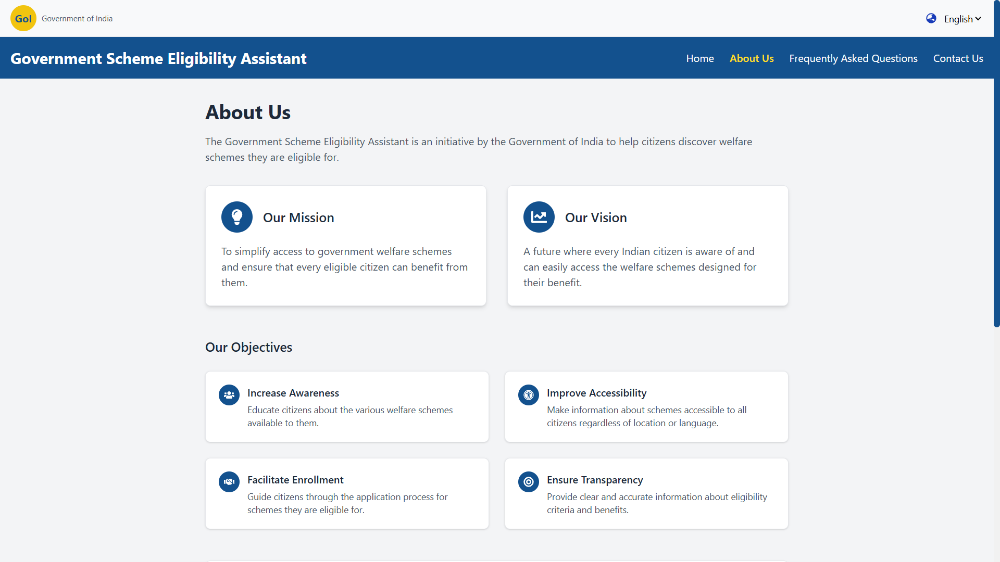
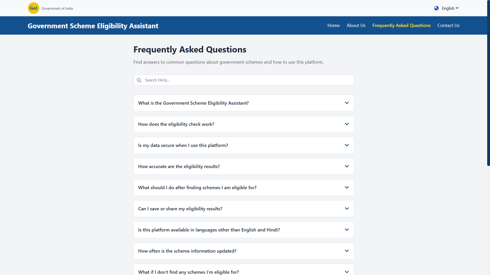
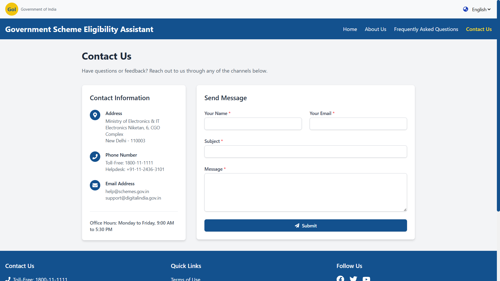

## Government Scheme Eligibility Assistant

Find Indian government welfare schemes you’re eligible for by entering basic profile details. The app supports English/Hindi, shows official links, and lets you bookmark, export, and share results. Built with React + Vite and a lightweight Node/Express API.

### Features

- Eligibility checker based on age, income, occupation, caste, gender, and location
- Bilingual UI (English/Hindi) with translations loaded from the API
- Rich results view with descriptions, application process, required documents, and official links
- Bookmark schemes in-app and optionally in the browser
- Export and share eligible schemes

### Tech stack

- Frontend: React 18, Vite, React Router 6, Tailwind CSS v4 (via `@tailwindcss/postcss`)
- UI/UX: React Icons, `react-loader-spinner`
- Data/API: Axios; Node.js + Express (CORS enabled)
- Dev tooling: ESLint, Vite build/preview, Nodemon (server), Concurrently

### Screenshots

Home

Eligibility Form

About

FAQ

Contact

### Local development

Prereqs: Node.js 18+ and npm

1. Install dependencies
   - Root: `npm install`
   - Server: `cd server && npm install && cd ..`
2. Start frontend and API together
   - Root: `npm run start`
3. Open
   - Frontend: `http://localhost:5173`
   - API: `http://localhost:5000`

Run separately (optional)

- Terminal 1 (root): `npm run dev`
- Terminal 2 (`server`): `npm run dev`

### Tailwind CSS setup (already configured)

- `postcss.config.js` uses `@tailwindcss/postcss`
- `src/index.css` imports Tailwind v4: `@import "tailwindcss";`

### API endpoints

- `GET /api/schemes`
- `POST /api/check-eligibility`
- `GET /api/locations`
- `GET /api/translations`

### License

MIT (or your preferred license)
